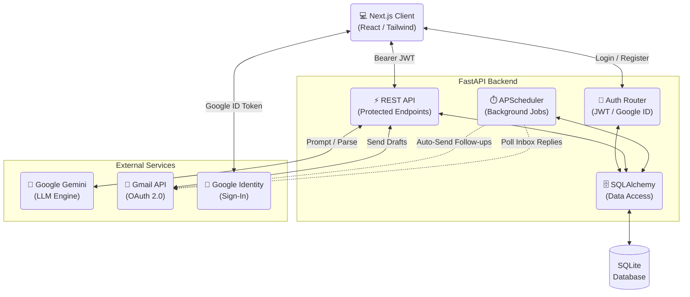

<div align="center">
  <h1>🚀 AutoRef</h1>
  <p><b>An AI-Powered, Multi-Tenant Job Outreach Automation Platform</b></p>
  
  [](https://fastapi.tiangolo.com/)
  [](https://nextjs.org/)
  [](https://deepmind.google/technologies/gemini/)
  [](https://sqlite.org/)
</div>

---

## 📖 Overview

AutoRef is an enterprise-grade, multi-tenant SaaS platform engineered to streamline and automate B2B/Job application outreach. It leverages **Google Gemini LLMs** to dynamically parse job descriptions and synthesize hyper-personalized referral emails based on the user's resume.

The platform integrates directly with the **Gmail API (OAuth 2.0)** for email dispatch and employs an intelligent **event-driven background scheduler** (`APScheduler`) for automated, multi-stage follow-up sequences and active reply detection.

This project demonstrates strong proficiency in **Systems Architecture, Secure Authentication, Third-Party Integrations, and Asynchronous Processing**.

---

## 🏗️ System Architecture

AutoRef is built on a modern decoupled architecture, ensuring scalability, maintainability, and a clear separation of concerns between the presentation and data/processing layers.



---

## ✨ Core Features & Technical Highlights

### 🛡️ Enterprise-Grade Auth & Multi-Tenancy
* **Robust Security:** Implements JWT-based authentication with `bcrypt` password hashing and Google Sign-In (OAuth ID Tokens).
* **3-Tier Dependency Injection:** FastAPI routes are protected via a strictly typed dependency chain (`Authenticated → Approved → Admin`).
* **Admin Gatekeeping:** First-user bootstrap strategy auto-approves the admin; subsequent registrations enter a pending state until manually approved via the Admin Panel, strictly preventing platform abuse.
* **Row-Level Isolation:** 100% data isolation across tenants using strict `user_id` foreign key scoping on all ORM queries.

### 🧠 Context-Aware AI Generation (Gemini)
* **Semantic Parsing:** Dynamically extracts Company, Role, and Skills from raw Job Description URLs/text.
* **Role-Specific Prompt Engineering:** Utilizes structured `role_configs` (Backend/SDE, Fintech, Data Engineering) to instruct the LLM on which specific achievements to highlight from the user's profile, generating high-converting B2B copy.

### ⏱️ Asynchronous Workflow Engine
* **Intelligent Follow-ups:** `APScheduler` orchestrates a stateful, multi-stage follow-up pipeline.
* **Rate-Limit Respecting:** Jobs are naturally throttled (1 per minute) to respect Gmail API limits and prevent spam flagging.
* **Idempotent Processing:** Terminal states (`sent`, `failed`, `cancelled`) ensure that transient network failures do not result in duplicate emails to recruiters.

### 🔄 Automated Inbox Monitoring
* **Event-Driven Polling:** Periodically monitors the connected Gmail inbox.
* **Reply Detection:** Autonomously detects replies from external domains, updates the application thread state, and immediately halts pending follow-up jobs.

---

## 🛠️ Technology Stack

| Domain | Technologies |
| :--- | :--- |
| **Frontend** | Next.js 16, React, Tailwind CSS, Context API |
| **Backend** | FastAPI, Python 3, Pydantic, Passlib, python-jose |
| **Database** | SQLite, SQLAlchemy (ORM), Alembic |
| **Background Jobs** | APScheduler |
| **Integrations** | Google Gemini API, Gmail API, Google Sheets API |

---

## 🚀 Local Development Setup

To run AutoRef locally, spin up both the FastAPI backend and the Next.js frontend.

### Prerequisites
* Python 3.9+
* Node.js 18+
* Google Cloud Console Account (Gmail API enabled, OAuth 2.0 Credentials configured)
* Google Gemini API Key

### 1. Backend Initialization (FastAPI)

```bash
cd backend
python -m venv venv
source venv/bin/activate  # Windows: venv\Scripts\activate
pip install -r requirements.txt

# Configure Environment
cp .env.example .env
# --> Edit .env with your specific API Keys and JWT secrets

# Start the API Server (Auto-migrates DB on first run)
uvicorn main:app --reload --port 8000
```

### 2. Frontend Initialization (Next.js)

Open a new terminal window:

```bash
cd frontend
npm install

# Configure Environment
cp .env.example .env.local
# --> Edit .env.local with your backend URL and Google Client ID

# Start the Development Server
npm run dev
```
Navigate to `http://localhost:3000` to access the application.

---

## 📸 Application Previews

| Dashboard Analytics | Outreach Generator | Admin Access Control |
| :---: | :---: | :---: |
|  |  | *(Admin panel for user approval routing)* |

---

## 📄 Author Resumes

| Target Engineering Domain | Resume Link |
| :--- | :--- |
| **SDE / Backend Engineering** | [View PDF (Google Drive)](https://drive.google.com/file/d/1-wUNnd1ZFThJ5NzPP7NJtFYHnUGZsBgC/view?usp=sharing) |


---
<div align="center">
  <i>Architected for scale, built for speed.</i>
</div>
