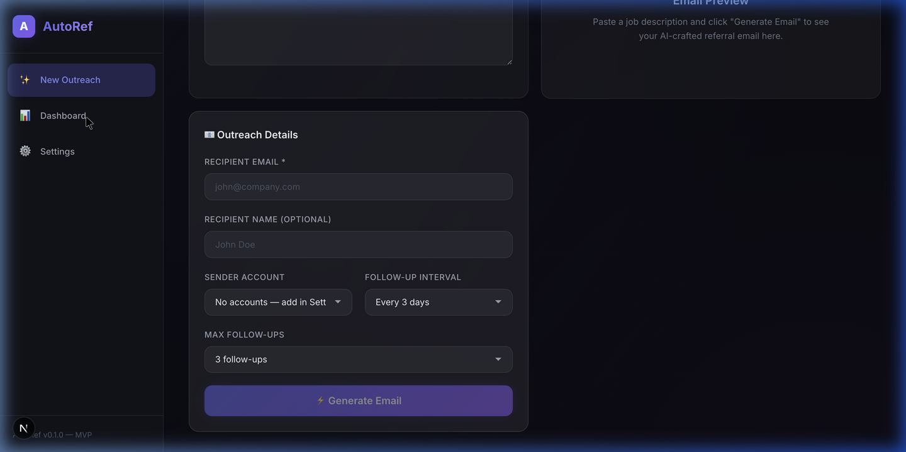
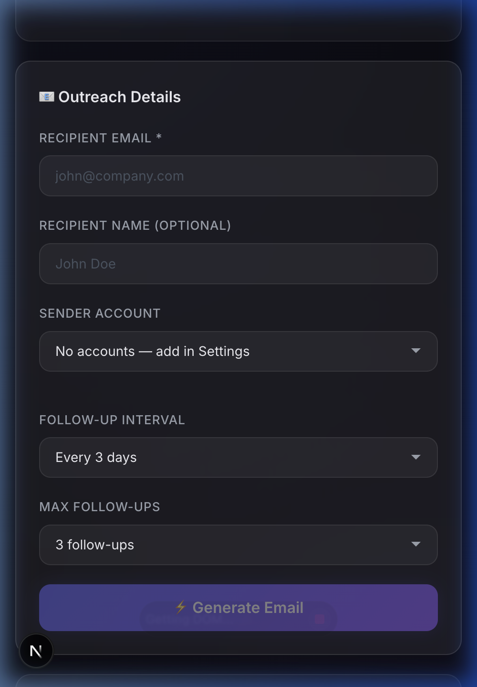
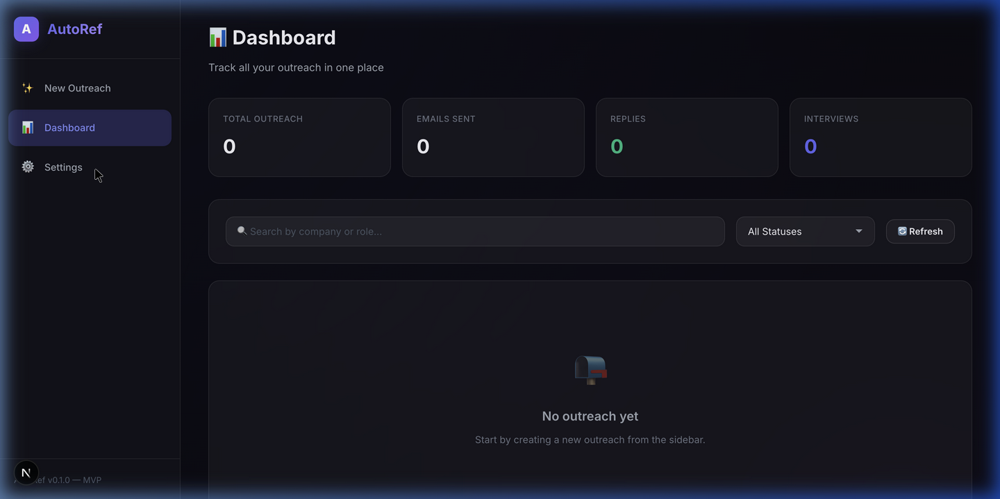

# AutoRef 🚀
**AI-Powered Job Outreach Automation Platform**

AutoRef is a full-stack, locally-hosted platform engineered to streamline and automate job application outreach. It leverages advanced LLMs (Google Gemini) to generate hyper-personalized referral emails, integrates seamlessly with the Gmail API for direct dispatch, and features an intelligent background scheduler for automated follow-ups and reply detection.

This project demonstrates proficiency in building production-ready, AI-integrated web applications with a focus on system architecture, secure API integrations, and robust asynchronous background processing.

## 🏗️ Architecture & Tech Stack

AutoRef is built using a modern decoupled architecture, ensuring scalability, maintainability, and clean separation of concerns.

*   **Frontend (Client):** Next.js, React, Tailwind CSS
    *   Responsive, component-driven UI for managing outreach pipelines.
    *   Client-side state management and asynchronous API polling.
*   **Backend (API & Background Jobs):** FastAPI, Python 3
    *   High-performance asynchronous REST API.
    *   `APScheduler` / Background Tasks for automated follow-up scheduling and inbox monitoring.
*   **Database:** SQLite / SQLAlchemy (ORM)
    *   Relational data modeling for tracking job applications, email statuses, and user profiles.
*   **AI Engine Integration:** Google Gemini API (Flash/Pro)
    *   Advanced prompt engineering to dynamically parse Job Descriptions and synthesize personalized, high-converting B2B emails based on user resumes.
*   **External Integrations:** Gmail API (OAuth 2.0)
    *   Secure token-based authentication for sending emails and monitoring threads directly on behalf of the user.

## ✨ Core Engineering Features

*   **Context-Aware Email Generation:** Utilizes Gemini AI to parse complex job descriptions (Company, Role, Skills) and weave them seamlessly with the user's professional profile, ensuring highly tailored outreach.
*   **Intelligent Follow-up Engine:** Implements a background scheduler that automatically dispatches follow-up emails if no reply is detected within a configurable timeframe (e.g., 3 days).
*   **Automated Reply Detection:** Periodically monitors the connected Gmail inbox to detect replies. Upon detection, it automatically updates the application state and halts any pending follow-up jobs to prevent double-emailing.
*   **Secure OAuth Authentication:** Manages Google OAuth 2.0 flows securely, storing encrypted refresh tokens to maintain persistent, authenticated API access without exposing user credentials.
*   **Stateful Tracking Dashboard:** Provides a real-time, persistent view of the outreach pipeline (Pending, Sent, Replied, Followed Up), with capabilities to sync analytics to external platforms like Google Sheets.

## 🚀 Getting Started

To run AutoRef locally, you will need to start both the backend API and the frontend client.

### Prerequisites
*   Python 3.9+
*   Node.js 18+
*   A Google Cloud Console account with the Gmail API enabled (and OAuth credentials).
*   A Google Gemini API Key.

### 1. Backend Setup (FastAPI)

```bash
cd backend
python -m venv venv
source venv/bin/activate  # On Windows: venv\Scripts\activate
pip install -r requirements.txt

# Create a .env file based on .env.example with your API keys
cp .env.example .env

# Start the API server
uvicorn main:app --reload --port 8000
```

### 2. Frontend Setup (Next.js)

Open a new terminal window:

```bash
cd frontend
npm install

# Start the development server
npm run dev
```

The application will be accessible at `http://localhost:3000`.

## 🎯 Usage Workflow

1.  **Onboard:** Connect your Gmail account via OAuth and paste your resume/background into the settings.
2.  **Generate:** Paste a Job Description link. The AI parses the requirements and drafts a highly personalized referral request.
3.  **Dispatch & Track:** Review the draft and hit send. The email is dispatched via your Gmail.
4.  **Automate:** The system tracks the email thread, auto-detects replies, and handles follow-ups autonomously.

## 📸 Application Previews

*A visual walkthrough of the platform's core interfaces.*

| Dashboard View | Outreach Generator | Configuration & Settings |
| :---: | :---: | :---: |
|  |  |  |

---
*Developed with a focus on engineering maturity, clean architecture, and practical AI application.*
