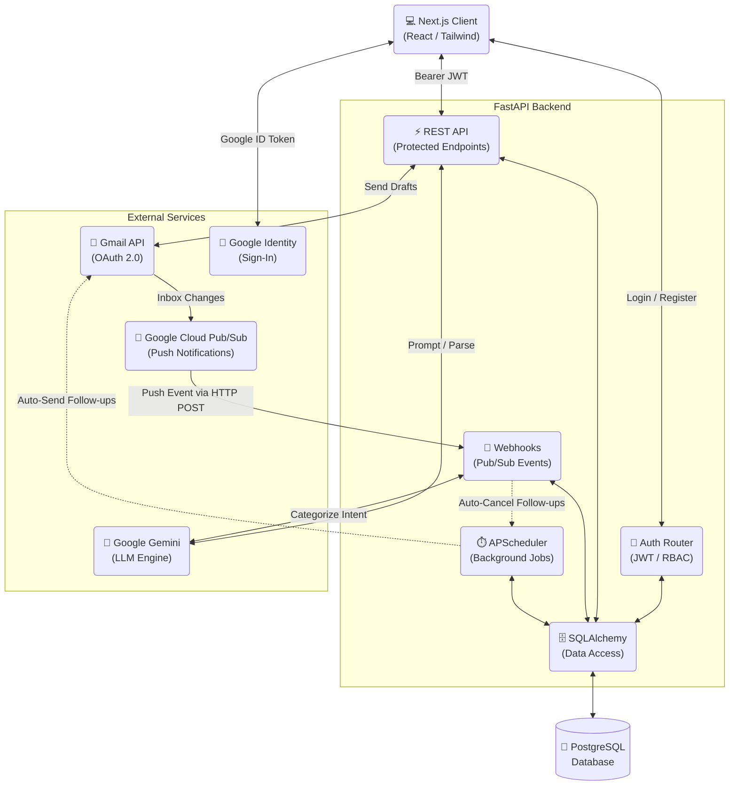

<div align="center">
  <h1>🚀 AutoRef</h1>
  <p><b>An AI-Powered, Event-Driven Job Outreach Automation SaaS</b></p>
  
  [](https://fastapi.tiangolo.com/)
  [](https://nextjs.org/)
  [](https://reactjs.org/)
  [](https://www.typescriptlang.org/)
  [](https://tailwindcss.com/)
  <br>
  [](https://deepmind.google/technologies/gemini/)
  [](https://cloud.google.com/)
  [](https://www.postgresql.org/)
  [](https://www.sqlalchemy.org/)
</div>

---

## 📖 Overview

AutoRef is an enterprise-grade, multi-tenant SaaS platform engineered to streamline and automate B2B/Job application outreach. It leverages **Google Gemini LLMs** to dynamically parse job descriptions and synthesize hyper-personalized referral emails based on the user's uploaded profile.

Designed with a modern **event-driven architecture**, AutoRef integrates seamlessly with the **Gmail API (OAuth 2.0)** and **Google Cloud Pub/Sub** for real-time inbox monitoring. It employs an intelligent **background scheduler (`APScheduler`)** for automated, multi-stage follow-up sequences and precision click tracking.

This project demonstrates strong proficiency in **Systems Architecture, Event-Driven Design, Secure Authentication, Third-Party Integrations, and Concurrent Background Processing**.

---

## 🏗️ System Architecture

AutoRef is built on a modern decoupled architecture, ensuring scalability, maintainability, and a clear separation of concerns between the presentation and data/processing layers.



---

## ✨ Core Features & Technical Highlights

### 📡 Event-Driven AI Reply Parsing
* **Real-Time Webhooks:** Shifted from cron-based polling to a true event-driven model using **Google Cloud Pub/Sub**, allowing the server to process recruiter replies the millisecond they arrive.
* **AI Intent Classification:** Inbound replies are intercepted and routed through Gemini to autonomously categorize the recruiter's intent (`interview_requested`, `referral_provided`, `rejected`).
* **Auto-Ghosting Prevention:** Based on the AI's classification, the system instantly cancels pending automated follow-ups for that specific thread, guaranteeing professional engagement logic.

### 🛡️ Enterprise-Grade Auth & Multi-Tenancy
* **Robust Security:** Implements JWT-based authentication with `bcrypt` password hashing and Google Sign-In (OAuth ID Tokens).
* **Role-Based Access Control (RBAC):** FastAPI routes are protected via a strictly typed dependency injection chain (`Authenticated → Approved → Admin`).
* **Modular User Management:** Comprehensive admin panel with strict toggles allowing admins to approve, reject, or completely revoke tenant access. 
* **Row-Level Isolation:** 100% data isolation across tenants using strict `user_id` foreign key scoping on all ORM queries.

### 🧠 Context-Aware AI Generation
* **Semantic Parsing:** Dynamically extracts Company, Role, and Skills from raw Job Description URLs/text.
* **Role-Specific Prompt Engineering:** Utilizes structured `role_configs` (Backend/SDE, Fintech, Data Engineering) to instruct the LLM on which specific achievements to highlight from the user's profile, generating high-converting B2B copy.

### ⏱️ Concurrent Workflows & Background Processing
* **Non-Blocking Webhook Ingestion:** Utilizes FastAPI's `BackgroundTasks` to instantly return `200 OK` responses to Google Pub/Sub, offloading heavy LLM parsing and database commits to concurrent background threads.
* **Stateful Pipeline Orchestration:** `APScheduler` manages concurrent, multi-stage follow-up pipelines in the background, naturally throttled to respect external API rate limits.
* **Click-Tracking Analytics:** Replaces legacy pixel tracking with robust URL-wrapping and redirect routing, providing highly accurate engagement metrics without triggering enterprise spam filters.
* **Idempotent Processing:** Terminal states (`sent`, `failed`, `cancelled`) ensure that transient network failures never result in duplicate emails.

### 📊 Visual Analytics Dashboard
* **Conversion Funnel:** A horizontal bar chart powered by **Recharts** visualizes the full pipeline (Jobs Scraped → Emails Sent → Clicked → Replied → Interviews), giving instant insight into drop-off rates at each stage.
* **Weekly Outreach Volume:** A dual-line graph tracks weekly email volume and reply trends over the last 12 weeks, aggregated via PostgreSQL `date_trunc`.
* **Single API Call:** Both charts are fed by a single `GET /api/dashboard/analytics` endpoint using conditional aggregation, avoiding waterfall requests on the frontend.

---

## 🛠️ Technology Stack

| Domain | Technologies |
| :--- | :--- |
| **Frontend** | Next.js 16 (App Router), React, Tailwind CSS, Context API |
| **Backend** | FastAPI, Python 3, Pydantic, Passlib, python-jose |
| **Database** | PostgreSQL, SQLAlchemy (ORM), Alembic |
| **Background Jobs** | APScheduler |
| **Integrations** | Google Gemini API, Gmail API, Google Cloud Pub/Sub |
| **Deployment** | Render (Backend/PostgreSQL), Vercel/Netlify (Frontend) |

---

## 🌍 Production Deployment

This project is built for seamless cloud deployment. The architecture natively supports:
- **Render** for hosting the FastAPI backend and managed **PostgreSQL** database instances.
- **Vercel / Netlify** for hosting the statically generated Next.js frontend.
- Continuous deployment via GitHub branch syncing.

---

## 🚀 Local Development Setup

To run AutoRef locally, spin up both the FastAPI backend and the Next.js frontend.

### Prerequisites
* Python 3.9+
* Node.js 18+
* Google Cloud Console Account (Gmail API enabled, OAuth 2.0 Credentials configured, Pub/Sub topic created)
* Google Gemini API Key

### 1. Backend Initialization (FastAPI)

```bash
cd backend
python -m venv venv
source venv/bin/activate  # Windows: venv\Scripts\activate
pip install -r requirements.txt

# Configure Environment
cp .env.example .env
# --> Edit .env with your specific API Keys and JWT secrets

# Start the API Server (Auto-migrates DB on first run)
uvicorn main:app --reload --port 8000
```

### 2. Frontend Initialization (Next.js)

Open a new terminal window:

```bash
cd frontend
npm install

# Configure Environment
cp .env.example .env.local
# --> Edit .env.local with your backend URL and Google Client ID

# Start the Development Server
npm run dev
```
Navigate to `http://localhost:3000` to access the application.

---

<div align="center">
  <i>Architected for scale, built for speed.</i>
</div>
